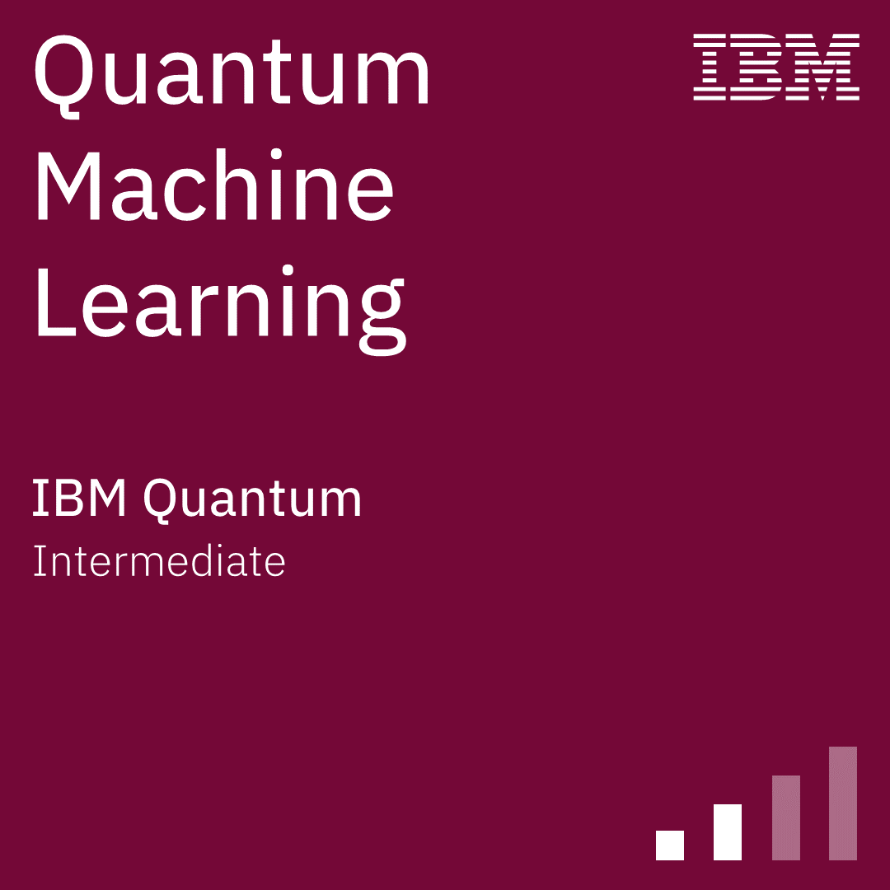
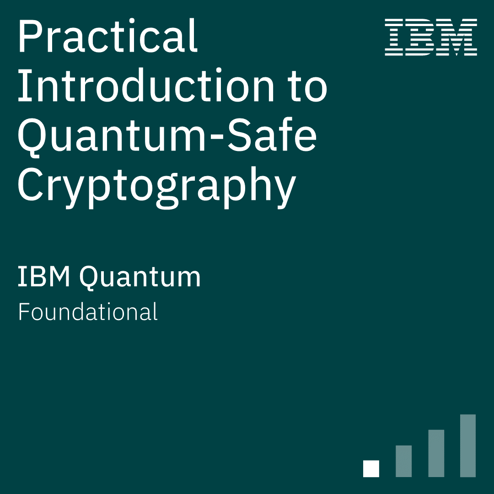
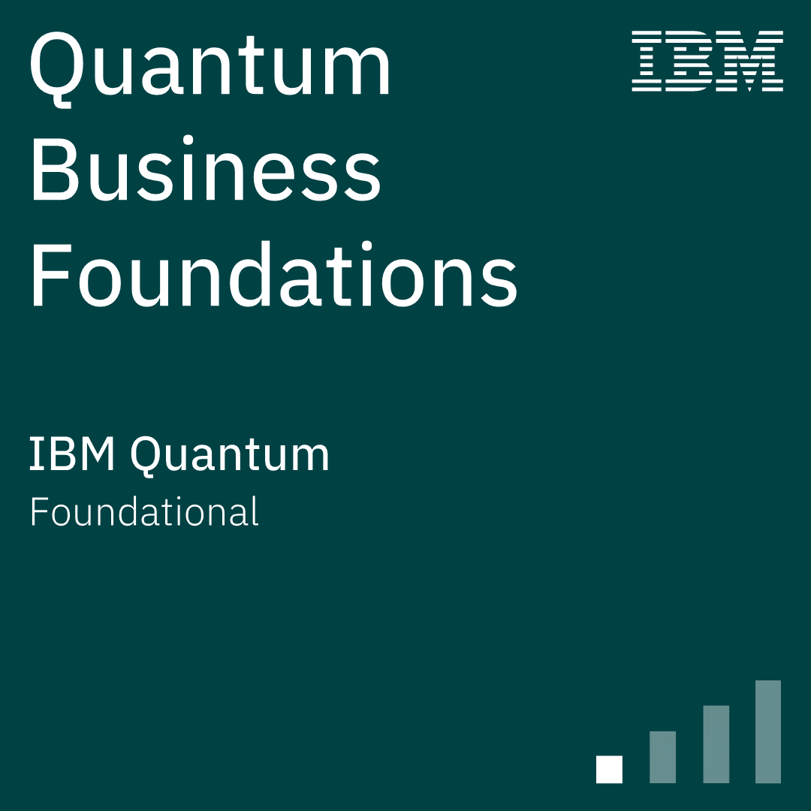
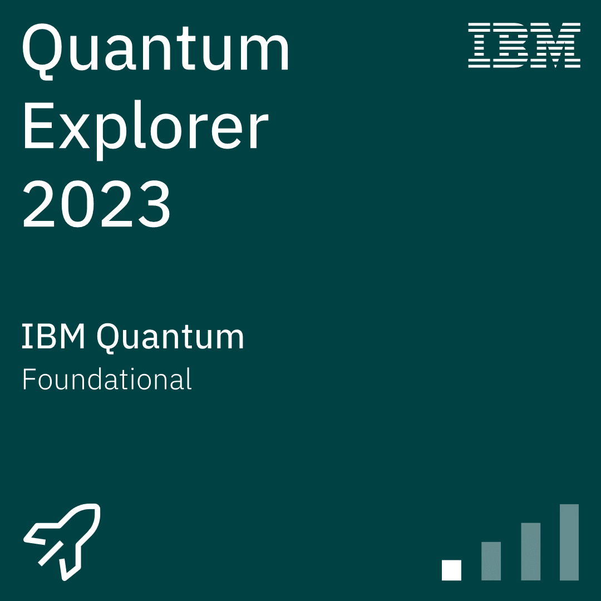

# Hi there 👋

I am Karthik, a Physics graduate from Freiburg, Germany. I am a former science educator passionate about communicating complex ideas to a broad audience in a way that they get an intuition about the underlying concepts.

## Master's thesis

My master's thesis, completed in August 2025 from the University of Freiburg focused on the topic of Combinatorial Optimization. 
Check out [this repository](https://github.com/aQuetzalcoatlus/kjayd-mthesis) to learn more and read the full-text.

## 🧩 Featured Projects

<table>
  <tr>
    <!-- Project 1: Schwarzwald -->
    <td align="center" width="33%">
      <a href="https://github.com/aQuetzalcoatlus/The-Schwarz-Forest">
        
         
        <strong>Forest loss in the Schwarzwald</strong>
      </a>
       
      
        Through this repository, I explore and analyse geographic data to identify forest cover and tree loss over a range of years.
      
    </td>
    <!-- Project 2: Contagion Simulation -->
    <td align="center" width="33%">
      <a href="https://github.com/aQuetzalcoatlus/Contagion-Spread">
        
         
        <strong>Infection Spread Simulation</strong>
      </a>
       
      
        A small agent-based simulation demonstrating how infections spread among moving particles and how vaccination levels influence the course of an outbreak.
      
    </td>
    <!-- Project 3: Quantum Stepping Stones -->
    <td align="center" width="33%">
      <a href="https://github.com/aQuetzalcoatlus/quantum-stepping-stones">
        
         
        <strong>QEC Exercises</strong>
      </a>
       
      
        A growing set of hands-on exercises for learners looking to understand quantum error correction concepts.
      
    </td>
  </tr>
</table>

## Past Projects

- [CCS Exercises](https://github.com/aQuetzalcoatlus/CCS_Exercises) : Archive of selected exercises I completed from the course "Classical Complex Systems" I completed in winter semester 2023 at the University of Freiburg.

- I occasionally try the [freeCodeCamp daily challenges](https://www.freecodecamp.org/learn/daily-coding-challenge/archive), and upload my results [here](https://github.com/aQuetzalcoatlus/myfreeCodeCamp_Challenges). This work is primarily aimed as a hobby, and additionally to help me practice clean code principles in Python.

## Certifications

<table style="table-layout: fixed; width: 80%;">
  <tr>
    <td style="width: 16%; text-align: center;">
       
      IBM Quantum Machine Learning
    </td>
    <td style="width: 16%; text-align: center;">
       
      IBM Practical Introduction to Quantum-Safe Cryptography
    </td>
    <td style="width: 16%; text-align: center;">
       
      IBM Quantum Business Foundations
    </td>
    <td style="width: 16%; text-align: center;">
       
      IBM Qiskit Global Summer School 2025
    </td>
    <td style="width: 16%; text-align: center;">
       
      IBM Quantum Explorer 2023
    </td>
  </tr>
</table>

<!--
**aQuetzalcoatlus/aQuetzalcoatlus** is a ✨ _special_ ✨ repository because its `README.md` (this file) appears on your GitHub profile.

Here are some ideas to get you started:

- 🔭 I’m currently working on ...
- 🌱 I’m currently learning ...
- 👯 I’m looking to collaborate on ...
- 🤔 I’m looking for help with ...
- 💬 Ask me about ...
- 📫 How to reach me: ...
- 😄 Pronouns: ...
- ⚡ Fun fact: ...
-->
